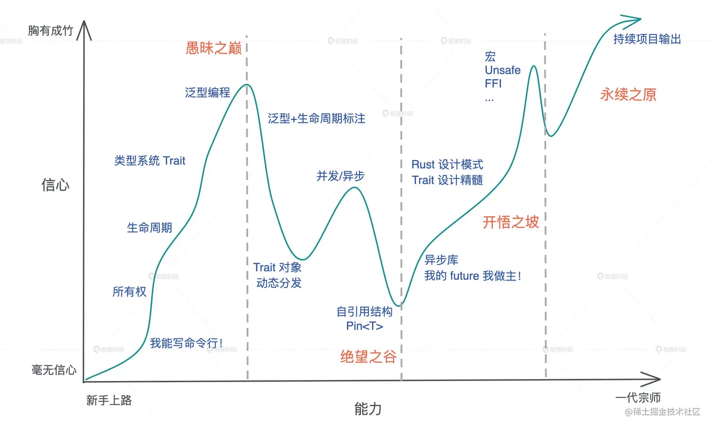

# rustStudy
rust学习项目,演练代码

## 目录

- [x] variable 变量
- [x] mathter 模式匹配
- [x] error 错误处理
- [x] pack 包管理
- [x] possession 所有权
- [x] test 测试
- [x] data_structure 常用数据结构
- [x] data_type 常用数据类型
- [ ] other 其他
- [x] fp 函数式编程
- [x] oop 面向对象编程
- [x] smart_point 智能指针
- [x] life_time 生命周期
- [x] typer 类型系统
- [x] macro 宏
- [ ] unsafe 不安全rust
- [ ] threads 多线程
- [ ] async 异步

## 学习步骤
